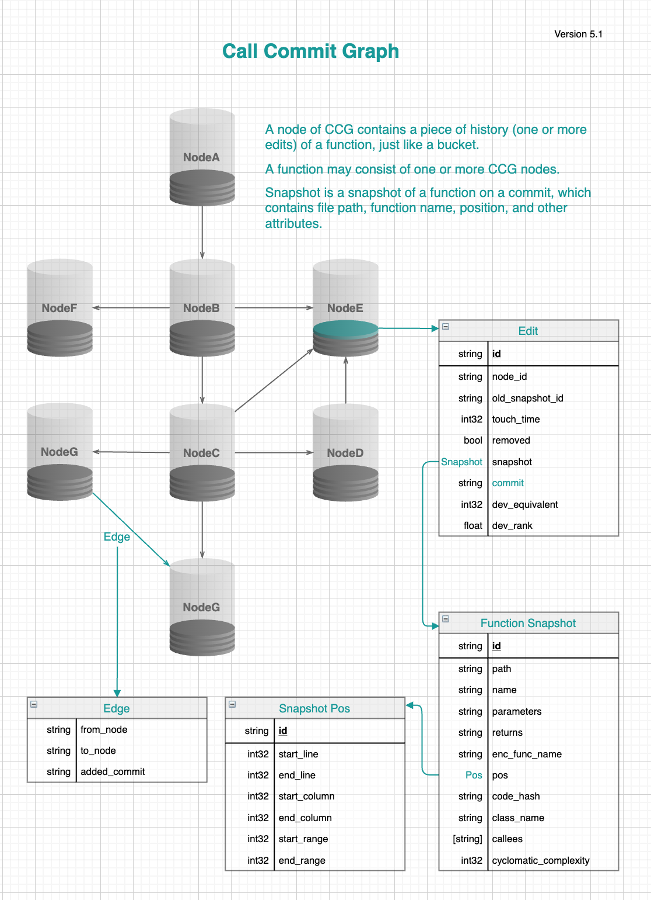

## Terminology

### What is indicator?

An analysis has one or more analyzers, and each analyzer computes one or more indicators.

### What is report?

A report is a group of indicators. The protocol files starting with `report_of_` is the entry files.

### What is CCG?

Call commit graph(CCG) is a graph where nodes are functions and edges are call relationships

A node of CCG contains a piece of history (one or more historical fragments) of a function, just like a bucket.

A function may consist of one or more CCG nodes.

A historical fragment is a function snapshot on a commit, which contains file path, function name, position, and other attributes.

## Protobuf streaming

1. [Streaming Multiple Messages](https://developers.google.com/protocol-buffers/docs/techniques#streaming)
    - https://github.com/protocolbuffers/protobuf/blob/2228af689f5ff4d929c85079025c49f6945b136a/java/core/src/main/java/com/google/protobuf/AbstractMessageLite.java#L88
    - https://github.com/protocolbuffers/protobuf/blob/f9d8138376765d229a32635c9209061e4e4aed8c/java/core/src/main/java/com/google/protobuf/AbstractParser.java#L271
2. The format of streaming file is: [4 bytes message_size][message][4 bytes message size][message]... The byte order is **big endian**.

## Proto naming and notes
1. For contributor, prefer `contributor` over `user`, `developer`, `coder`
2. For counter, prefer `count` over `number`, `size`, `length`
3. For file path, prefer `file_path` over `file`, `filename`, `path`
4. For function name, prefer `func_name` over `func`, `name`
5. For function unique id, prefer `func_id` over `uid`, `function_id`
6. For email, prefer `email` over `author`, `committer`, `user`, `developer`
7. For commit id, prefer `hexsha` over `hex`, `sha`, `hash`, `id`
8. For dev rank, prefer `dev_rank` over `dev_value`, `devrank`
9. function -> func, repository -> repo, equivalent -> eq, fragment -> frag, 
10. All time fields should be timestamp, seconds from 1970-01-01.
11. All percentages are in decimal form.

## Report large data sets

| Key       | How many rows                                                | Django rows as example|
| --------- | ------------------------------------------------------------ | ------------ |
| commits   | The number of the commits in a repository                    | 38952 |
| ccg.nodes | All the functions that have appeared in the repository history | 41737 |
| ccg.edges | All the call relationships of functions that have appeared in the repository history | 2197315 |
| ccg.frags | The number of times all functions in the project history have been modified | 178853 |
